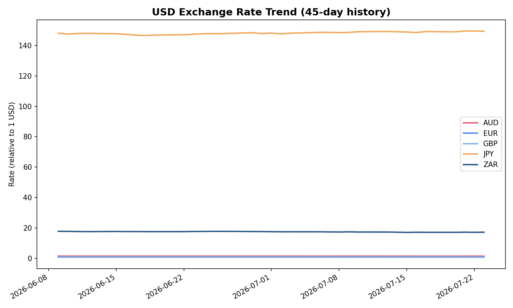

# Automated Exchange Rate Tracker

An automation and API-integration sample project: a Python pipeline that fetches live currency exchange rates from a public API every day **on its own** via a scheduled GitHub Action, cleans and processes the data, and presents it through an interactive dashboard and Excel workbook. Includes a separate web scraping module demonstrating structured data extraction from a live webpage.

**[View the live dashboard](dashboard.html)**



## What this demonstrates

| Skill | Where it shows up |
|---|---|
| **API Integration** | `fetch_exchange_rates.py` — calls the [Frankfurter API](https://frankfurter.dev), a free public REST API, no key required |
| **Automated Workflow** | `.github/workflows/daily_fetch.yml` — a GitHub Actions workflow that runs the fetch script every day at 06:00 UTC automatically and commits new data, with zero manual intervention |
| **Web Scraping** | `scrape_market_headlines.py` — uses `requests` + `BeautifulSoup` to extract structured data from a live webpage across paginated results |
| **Python** | The entire pipeline: requests, BeautifulSoup, pandas, matplotlib, openpyxl |
| **Data Processing & Analytics** | `process_and_report.py` — deduplication, pivoting, trend analysis, chart generation |
| **Excel reporting** | `Exchange_Rate_Summary.xlsx` — pivot table, live formulas, native Excel chart |

## Why this is a genuine automation demo, not just a script

Most portfolio "automation" pieces are just a script that *could* be scheduled. This one actually is: the GitHub Action in this repo runs on a real schedule (daily) and, given the repository's own commit history, provably keeps updating `exchange_rate_history.csv` without anyone touching it. You can check the **Actions** tab on the live repo to see the run history.

## Pipeline

```
fetch_exchange_rates.py   → calls Frankfurter API, appends today's rates
        │                    to exchange_rate_history.csv
        ▼
exchange_rate_history.csv  (grows daily via the scheduled GitHub Action)
        │
        ▼
process_and_report.py     → cleans, pivots, generates charts + Excel workbook
        │
        ├──► exchange_rate_trend.png, latest_rates_snapshot.png
        └──► Exchange_Rate_Summary.xlsx

scrape_market_headlines.py → separate module: scrapes a live public site,
                              outputs scraped_quotes.csv

dashboard.html              → interactive view of the tracked data (Chart.js)
```

## Key details (from the current dataset)

- **Base currency:** USD
- **Tracked:** ZAR, EUR, GBP, JPY, AUD
- **History:** 45 days of daily rates (weekdays only, matching FX market activity)
- Data updates automatically going forward via the scheduled workflow

## Repository contents

```
├── fetch_exchange_rates.py       # calls the live API, appends to history
├── generate_seed_history.py      # (one-off) seeded initial 45 days of example data
├── scrape_market_headlines.py    # web scraping demo (separate data source)
├── process_and_report.py         # cleaning, analysis, charts, Excel workbook
├── exchange_rate_history.csv     # accumulated daily rate data
├── scraped_quotes.csv            # scraping output (placeholder until re-run with network access)
├── exchange_rate_trend.png       # chart export
├── latest_rates_snapshot.png     # chart export
├── dashboard.html                # interactive standalone dashboard
├── Exchange_Rate_Summary.xlsx    # pivot table + KPIs + native chart
├── requirements.txt              # Python dependencies
├── .github/workflows/daily_fetch.yml   # the scheduled automation itself
└── README.md
```

## Running it yourself

```bash
pip install -r requirements.txt
python fetch_exchange_rates.py      # pulls today's live rates
python scrape_market_headlines.py   # scrapes example site
python process_and_report.py        # rebuilds charts + Excel summary
```

## Notes

- `generate_seed_history.py` was used once to backfill 45 days of realistic example data so the dashboard has something to show immediately — going forward, the scheduled GitHub Action is what keeps the dataset current.
- The Frankfurter API requires no authentication, making it a clean example of API integration without needing to manage secret keys.
- `scrape_market_headlines.py` targets `quotes.toscrape.com`, a site purpose-built for scraping practice — the same request → parse → extract pattern applies directly to real sites like news headlines, product listings, or job boards.
- `dashboard.html` is self-contained (data embedded directly in the file) aside from one CDN reference to Chart.js.
